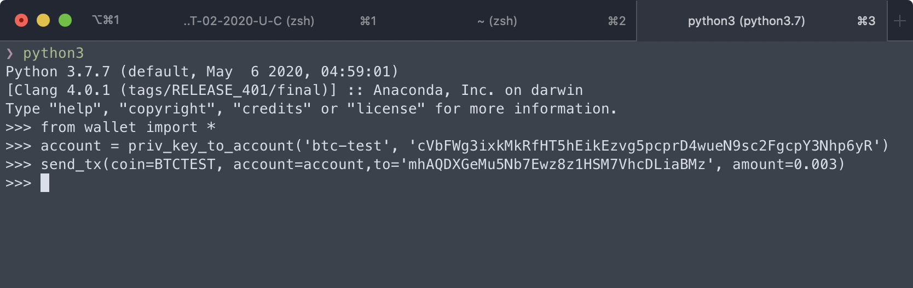
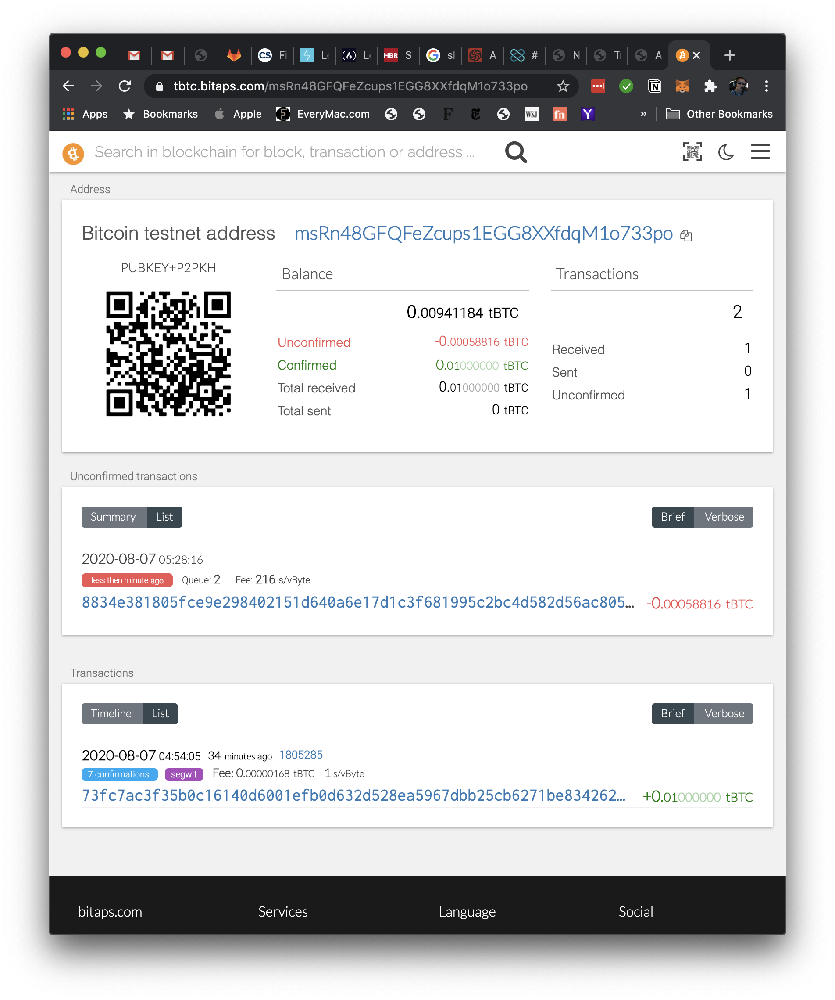
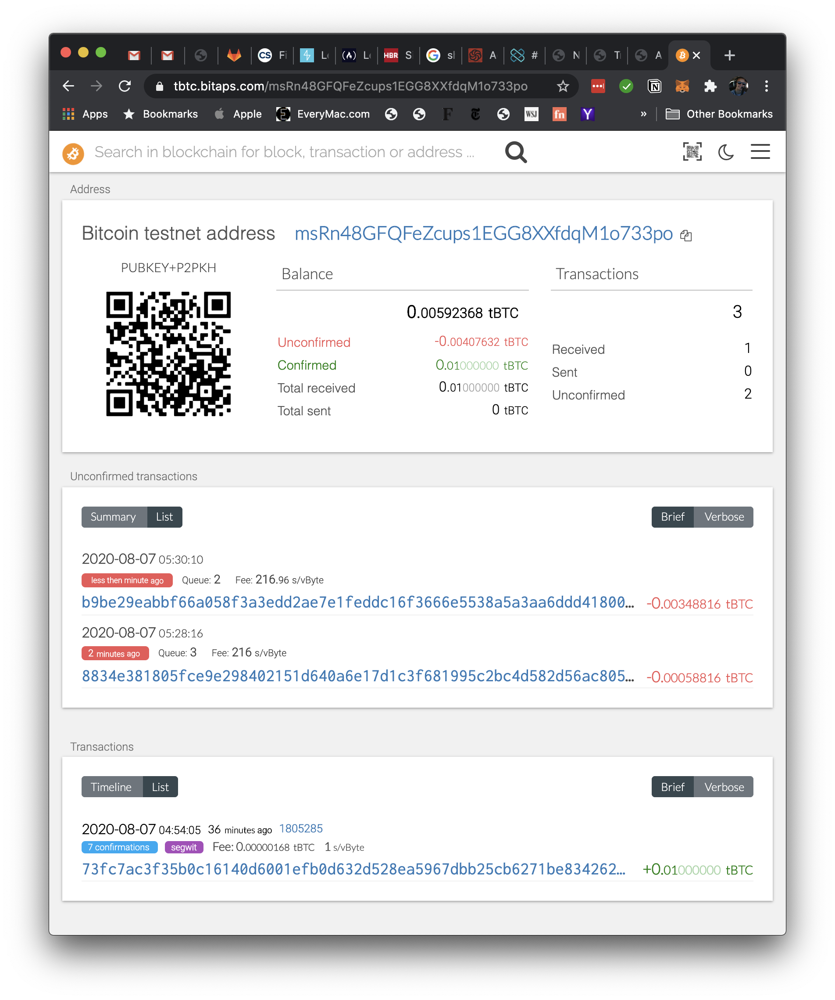
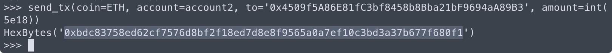
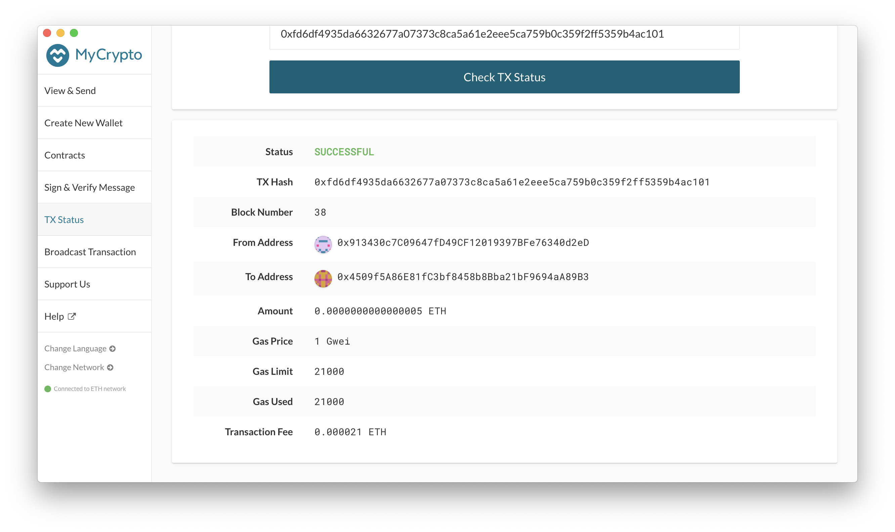
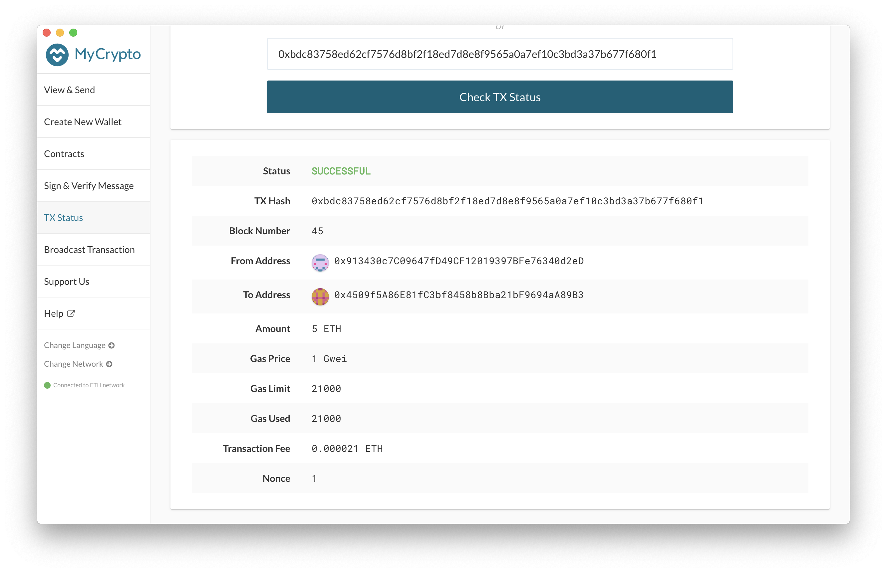

# Multi-Currency Crypto Wallet

## About this wallet
This wallet was written in Python3 using the `bit` and `web3.py` libraries. It allows the user to derive their wallets for around 300 crypto currencies using their mnemonic phrase only.

It also enables users to send BTC and ETH over the test networks (for ETH, users need to have a local network running on localhost:8545).

There are four main functions that make up the wallet, of which the user will be using three (derive_wallets, priv_key_to_account, and send_tx).

To send a transaction, the user will need to first derive their wallets using the derive_wallets function. Then, the user will need to get the account from the private key for their desired network (BTC or ETH test networks) using the priv_key_to_account function. Lastly, the user will need to use the send_tx function to send a transaction to another account on the testnet.


## Main functions used

**Derive wallets from mnemonic phrase**

```python
def derive_wallets(mnemonic, coin, num_keys):
    p = subprocess.Popen(
        f'./derive -g --mnemonic="{mnemonic}" --coin={coin} \
            --numderive={num_keys} --format=json',
        stdout=subprocess.PIPE,
        shell=True
    )
    
    (output, _) = p.communicate()

    return json.loads(output)
```

**Get account from private key**

```python
def priv_key_to_account(coin, priv_key):
    if coin == ETH:
        return Account.privateKeyToAccount(priv_key)
    elif coin == BTCTEST:
        return PrivateKeyTestnet(priv_key)
```

**Create raw transaction**

```python
def create_tx(coin, account, to, amount):
    if coin == ETH:
        gas_estimate = w3.eth.estimateGas(
            {'from': account.address, 'to': to, 'value': amount}
        )
        return {
            'to': to,
            'from': account.address,
            'value': amount,
            'gas': gas_estimate,
            'gasPrice': w3.eth.gasPrice,
            'nonce': w3.eth.getTransactionCount(account.address),
        }
    elif coin == BTCTEST:
        return PrivateKeyTestnet.prepare_transaction(
            account.address,
            [(to, amount, BTC)]
            )
```

**Sign and send transaction**

```python
def send_tx(coin, account, to, amount):
    raw_tx = create_tx(coin, account, to, amount)
    signed_tx = account.sign_transaction(raw_tx)
    if coin == ETH:
        return w3.eth.sendRawTransaction(signed_tx.rawTransaction)
    elif coin == BTCTEST:
        return NetworkAPI.broadcast_tx_testnet(signed_tx)
```

## Test transactions sent
### BTC (Testnet)

```shell
from wallet import *
account = priv_key_to_account('btc-test', 'cVbFWg3ixkMkRfHT5hEikEzvg5pcprD4wueN9sc2FgcpY3Nhp6yR')

# transaction 1
send_tx(coin=BTCTEST, account=account, to='mhAQDXGeMu5Nb7Ewz8z1HSM7VhcDLiaBMz', amount=0.0001)

# transaction 2
send_tx(coin=BTCTEST, account=account, to='mhAQDXGeMu5Nb7Ewz8z1HSM7VhcDLiaBMz', amount=0.003)
```







### ETH (on local testnet)

```shell
from wallet import *
account2 = priv_key_to_account('eth', '0x9882016626cbbff782d07fb927917ff21f406add2ff5b82928a70b2df921fdf8')

# transaction 1
send_tx(coin=ETH, account=account2, to='0x4509f5A86E81fC3bf8458b8Bba21bF9694aA89B3', amount=5)

# transaction 2
send_tx(coin=ETH, account=account2, to='0x4509f5A86E81fC3bf8458b8Bba21bF9694aA89B3', amount=int(5e18))
```







## Pre-requisites
The required Python packages can be installed using `pip3 install -r requirements.txt` after navigating to the wallet's directory from the terminal.

As for hd-wallet-derive, installation instructions follow (assuming that PHP is already installed).

* Navigate to the [Github website](https://github.com/dan-da/hd-wallet-derive) for the `hd-wallet-derive` library and scroll down to the installation instructions.

 

* Next, open a terminal and execute the following commands. If you are using Windows, you will need to open the `git-bash` GUI via `C:\Program Files\Git\bin\bash.exe` directly to enable something called `tty` mode that makes the terminal more compatible with Unix systems. Once installed, you may move back to using the usual `git-bash` terminal.

 ```shell
 git clone https://github.com/dan-da/hd-wallet-derive
 cd hd-wallet-derive
 php -r "readfile('https://getcomposer.org/installer');" | php
 php -d pcre.jit=0 composer.phar install
 ```

* You should now have a folder called `hd-wallet-derive` containing the PHP library.

To be able to run a local ETH testnet, you can either install [Ganache](https://www.trufflesuite.com/ganache) or [Go Ethereum](https://geth.ethereum.org/)